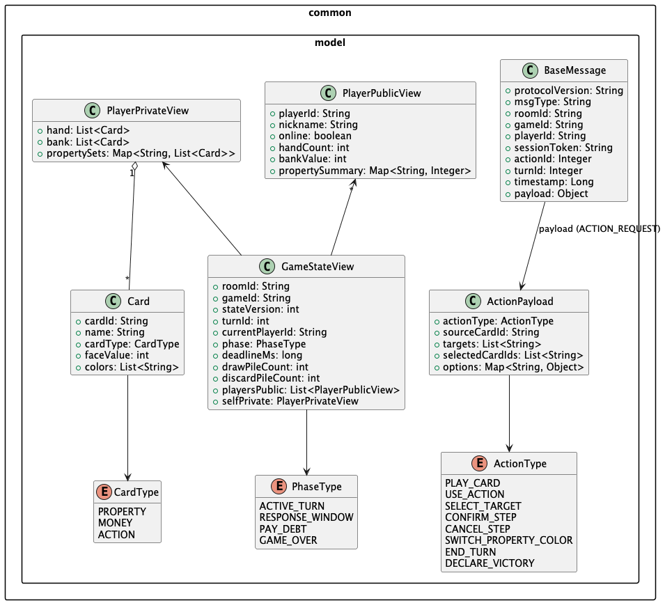
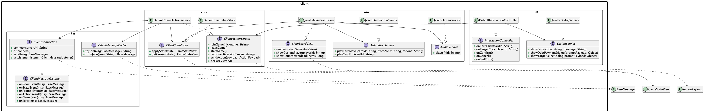
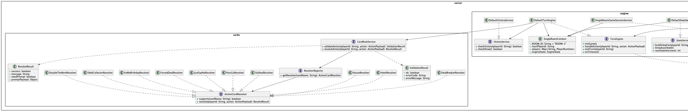
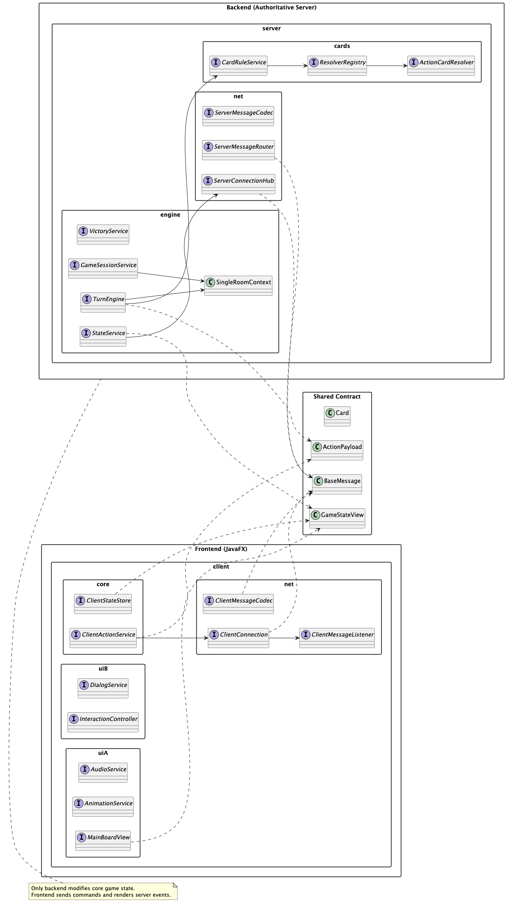
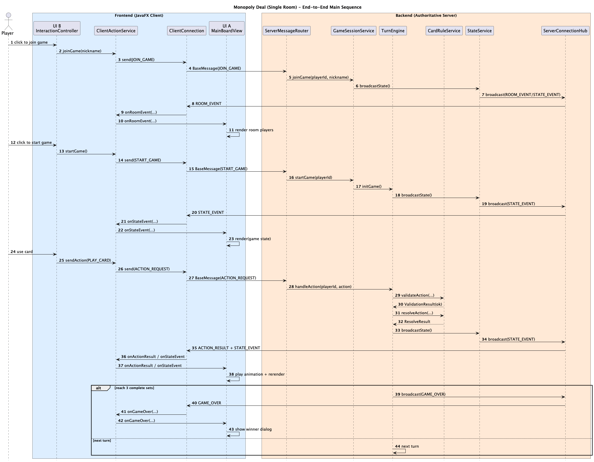
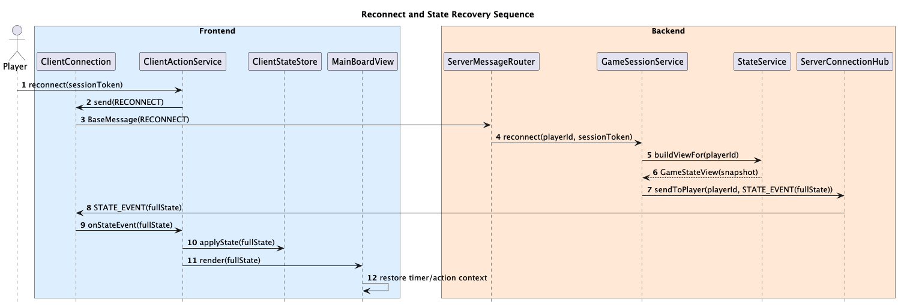
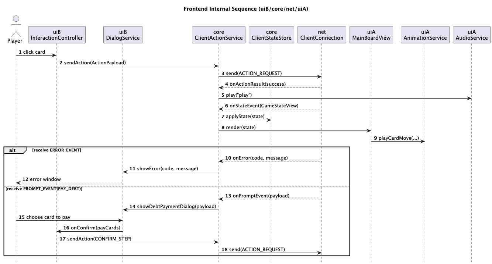
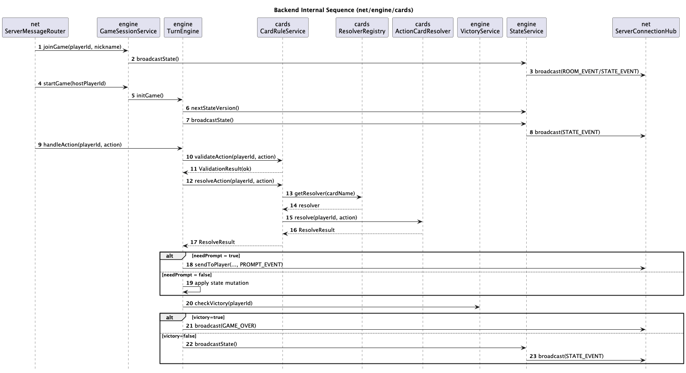
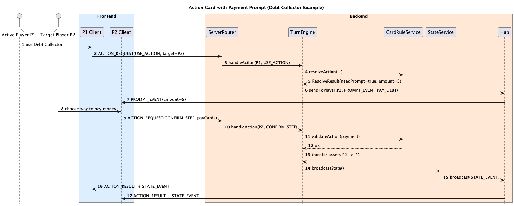

# Monopoly Deal Cards Game

## Requirement

## User Requirements

### Player Join and Game Start
- As a player, I want to quickly create and start a game for 2 to 5 players.
- As a player, I want the system to shuffle cards, deal cards, and initialize public and player areas automatically.
- As a player, I want the UI layout to adjust by player count so all player information is visible.

### Turn and Time Limit
- As a player, I want to clearly see the current active player and turn order.
- As a player, I want to see the remaining time for active turns and passive response turns.
- As a player, I want to end my current turn manually when needed.

### Card Play and Interaction Feedback
- As a player, I want clear prompts for current available actions (play, respond, pay, etc.).
- As a player, I want to click to select cards to play and click again to unselect.
- As a player, I want to confirm submit when an action needs multiple cards.
- As a player, I want a clear message immediately when I try an illegal action.

### Settlement and Win/Lose
- As a player, I want the system to handle rent, stealing, swapping, payment, and settlement automatically and consistently.
- As a player, I want the system to announce the winner and end the game in time when win condition is met.
- As a player, I want the system to declare a draw correctly when both draw pile and discard pile are empty.
- As a player, I want to start a "Declare Victory" action when I think I meet win condition, and let system check the result.

### Visualization and Experience
- As a player, I want to clearly see my hand, bank area, property area, and other players' public areas.
- As a player, I want smooth animation and state updates, so lag does not affect decisions.

### Online Match
- As a player, I want to create a room and invite other players to join remotely.
- As a player, I want auto reconnect and state recovery after short network issues.
- As a player, I want to see other players' online status and disconnection hints in online games.

## System Requirements

### System Architecture Requirements
- The system must use a frontend-backend separated architecture.
- The frontend must use JavaFX for GUI and interaction logic.
- The backend must handle rule engine, turn control, card state, and settlement.
- Frontend and backend must communicate with JSON messages. Messages should include event type, turn info, player id, card/area data, and timestamp (or sequence id).
- Frontend must not change core game state directly. All state changes must follow backend decisions.
- The system should support in-game state snapshot (JSON) output for debug, replay, or reconnect extension.
- The system should support multiplayer online client-server architecture.
- Backend must be the only authoritative state source and handle rule checks and state broadcast.
- Frontend should join or recover a game by session info (roomId, playerId, sessionToken).
- Online mode should support state sync after reconnect (hand cards, public area, countdown, current action context).

### Functional Requirements

#### Game Initialization
- The system must support creating a game with 2 to 5 players.
- The system must initialize 106 cards and build draw pile and discard pile.
- The system must create each player's hand area, bank area, and property area, and show public info on UI.
- The system must shuffle cards and deal 5 hand cards to each player at game start.
- The system must randomly choose first player and build clockwise turn order.

#### Turn Flow
- At active turn start, player draws 2 cards. If player starts with 0 hand cards, player draws 5 cards instead.
- Active player can play at most 3 actions in one turn, and can also play 0 action and end turn manually.
- Active turn time is 60 seconds. Timeout should auto end turn and switch to next player.
- Passive response stage time is 60 seconds. Timeout should auto perform legal default action by system.
- Turn switching must be scheduled by backend only. Frontend only shows state updates.

#### Cards and Rule Execution
- The system must support rule-based use of property cards (single-color, dual-color, wild), money cards, and action cards.
- The system must support dual-color/wild property color switching during player's active turn.
- The system must support these action card effects: Sly Deal, Deal Breaker, House, Hotel, Double The Rent, Debt Collector, It's My Birthday, Forced Deal, Just Say No, Pass Go.
- The system must support rent card rules: dual-color rent needs matching property condition; rent wild can be used for any color.
- After action card settlement, the system must put action card into discard pile (except action cards used as cash).
- If draw pile is empty, the system must reshuffle discard pile into draw pile. If both are empty, system declares draw.

#### Payment and Settlement
- Claimed player can pay with bank money cards, played property cards, and action cards in bank.
- The system must not allow direct payment from hand cards.
- When cash is not enough, system must allow and guide player to use payable properties until payment is complete or no payable cards remain.
- Receiver must put received money cards into bank area. Received property cards can go to property area by rules (or go to bank by face value, based on player decision and rule limits).
- If payer cannot fully pay and has no more payable cards, system continues game by "pay all possible assets" rule.

#### Operability Check and Hints
- The system must calculate and highlight playable cards and valid targets in real time.
- Unusable action cards must be marked as not operable (for example, no legal target).
- If player tries illegal card play or illegal target, system must block action and show reason.
- Multi-step actions (such as multi-card payment, target selection) must support confirm and cancel.

#### Win/Lose Check
- When any player forms 3 complete property sets, system must immediately mark that player as winner and end game.
- The system must provide clear end-game display (winner, draw reason, end time).
- The system must support player-initiated "Declare Victory" and check win condition immediately. If check fails, system gives reason and game continues.

#### Frontend-Backend Communication
- All frontend user actions (play card, select target, confirm, end turn) must be serialized as JSON requests to backend.
- Backend must push JSON response/events after each state change. Frontend refreshes view based on that.
- JSON communication must include error code and error message for illegal action hint and recovery.
- Messages in same game must include ordering id (for example, turnId, actionId) to avoid out-of-order display.

#### Online Session and Sync
- The system must support online session flow: create room, join room, leave room, close room.
- Host can start game only when player count is 2 to 5. Game cannot start if player count is not enough.
- After disconnection, player can reconnect within session validity and recover identity and game state.
- Server should broadcast online status of room players periodically or after key state changes.
- If player disconnects or does not respond in time, system should execute default managed action by rules (for example, random legal choice or auto end stage).
- All clients must receive same authoritative state snapshot and verify consistency by server version/action sequence.
- After successful reconnect, frontend should rebuild full view and operable state from latest JSON snapshot.

#### Rule Data Additions (from game.md)
- The system must use fixed 106-card deck, and card count/value must match `game.md`:
  single-color properties (Brown 2 / Light Blue 3 / Pink 3 / Orange 3 / Red 3 / Yellow 3 / Green 3 / Dark Blue 2 / Railroad 4 / Utility 2),
  dual-color properties (Pink-Orange 2, Utility-Railroad 1, Railroad-Light Blue 1, Railroad-Brown 1, Green-Railroad 1, Green-Dark Blue 1, Red-Yellow 1, Brown-Light Blue 1),
  wild property 2,
  money cards (1M*6, 2M*5, 3M*3, 4M*3, 5M*2, 10M*1),
  action cards (Sly Deal*3, Deal Breaker*2, House*3, Hotel*2, Double The Rent*2, Debt Collector*3, It's My Birthday*3, Forced Deal*3, Just Say No*3, Pass Go*10),
  rent cards (Rent Wild*3, Railroad-Utility*2, Green-Dark Blue*2, Brown-Light Blue*2, Pink-Orange*2, Red-Yellow*2).
- The system must use fixed rent table and complete-set size, matching `game.md`:
  set sizes: Brown 2, Light Blue 3, Pink 3, Orange 3, Red 3, Yellow 3, Green 3, Dark Blue 2, Railroad 4, Utility 2;
  rent levels: Brown (1/2), Light Blue (1/2/3), Pink (1/2/4), Orange (1/3/5), Red (2/3/6), Yellow (2/4/6), Green (2/3/7), Dark Blue (3/8), Railroad (1/2/3/4), Utility (1/2), unit: M.
- Dual-color properties and wild properties can change color only during player's active turn, not in non-active turns.

#### Rule Detail Additions (from game.md)
- Hand card limit is 7. If over limit, system must require player to process extra cards, and return extra cards to bottom of deck by rules.
- Action card target must support player selection and confirmation. Passive player must be able to respond with payment/passive swap.
- If action card has no legal target, card must be marked unusable. `Debt Collector` and `It's My Birthday` can still be played when target has insufficient money.
- `Deal Breaker` can take one complete property set from target player, including `House`/`Hotel` on that set.
- `House` can only be added on complete property set, and cannot be used on railroad set and utility set. `Hotel` can only be added on complete property set.
- `Forced Deal` can only exchange properties in non-complete sets. It cannot exchange properties in complete sets.
- `Just Say No` can cancel action cards targeting self, and can also counter opponent's `Just Say No`.
- After using `Pass Go`, player draws 2 extra cards.

#### Detailed Card List (Function + Value)

##### Property Cards
| Card | Count | Value | Detail Function |
|---|---:|---:|---|
| Brown Single-Color Property | 2 | 1M | Put in property area; forms brown set (complete with 2 cards); can collect rent / can be used as payment asset. |
| Light Blue Single-Color Property | 3 | 1M | Put in property area; forms light blue set (complete with 3 cards); can collect rent / can be used as payment asset. |
| Pink Single-Color Property | 3 | 2M | Put in property area; forms pink set (complete with 3 cards); can collect rent / can be used as payment asset. |
| Orange Single-Color Property | 3 | 2M | Put in property area; forms orange set (complete with 3 cards); can collect rent / can be used as payment asset. |
| Red Single-Color Property | 3 | 3M | Put in property area; forms red set (complete with 3 cards); can collect rent / can be used as payment asset. |
| Yellow Single-Color Property | 3 | 3M | Put in property area; forms yellow set (complete with 3 cards); can collect rent / can be used as payment asset. |
| Green Single-Color Property | 3 | 4M | Put in property area; forms green set (complete with 3 cards); can collect rent / can be used as payment asset. |
| Dark Blue Single-Color Property | 2 | 4M | Put in property area; forms dark blue set (complete with 2 cards); can collect rent / can be used as payment asset. |
| Railroad Single-Color Property | 4 | 2M | Put in property area; forms railroad set (complete with 4 cards); can collect rent / can be used as payment asset. |
| Utility Single-Color Property | 2 | 2M | Put in property area; forms utility set (complete with 2 cards); can collect rent / can be used as payment asset. |
| Pink/Orange Dual-Color Property | 2 | 2M | In active turn, can be pink or orange property; can switch color in active turn. |
| Utility/Railroad Dual-Color Property | 1 | 2M | In active turn, can be utility or railroad property; can switch color in active turn. |
| Railroad/Light Blue Dual-Color Property | 1 | 4M | In active turn, can be railroad or light blue property; can switch color in active turn. |
| Railroad/Brown Dual-Color Property | 1 | 1M | In active turn, can be railroad or brown property; can switch color in active turn. |
| Green/Railroad Dual-Color Property | 1 | 4M | In active turn, can be green or railroad property; can switch color in active turn. |
| Green/Dark Blue Dual-Color Property | 1 | 4M | In active turn, can be green or dark blue property; can switch color in active turn. |
| Red/Yellow Dual-Color Property | 1 | 3M | In active turn, can be red or yellow property; can switch color in active turn. |
| Brown/Light Blue Dual-Color Property | 1 | 1M | In active turn, can be brown or light blue property; can switch color in active turn. |
| Wild Property | 2 | 0M | Can be any color property; can switch color in active turn. |

##### Action Cards
| Card | Count | Value | Detail Function |
|---|---:|---:|---|
| Sly Deal | 3 | 3M | Steal one property card in a non-complete set from one player. |
| Deal Breaker | 2 | 5M | Take one complete property set from one player (including House/Hotel on it). |
| House | 3 | 3M | Add to one complete property set, rent +3M (cannot add on railroad set or utility set). |
| Hotel | 2 | 4M | Add to one complete property set, rent +4M. |
| Double The Rent | 2 | 1M | Can only be used with a rent card, doubles current rent. |
| Debt Collector | 3 | 3M | Collect 5M from one target player. |
| It's My Birthday | 3 | 2M | Collect 2M from each other player. |
| Forced Deal | 3 | 3M | Exchange one property card in non-complete set with target player. |
| Just Say No | 3 | 4M | Cancel action card targeting self; can also counter opponent's Just Say No. |
| Pass Go | 10 | 1M | Draw 2 extra cards immediately. |
| Rent Wild | 3 | 3M | Collect rent for any property color you own. |
| Railroad/Utility Rent | 2 | 1M | Rent only for railroad or utility property (you must own matching property). |
| Green/Dark Blue Rent | 2 | 1M | Rent only for green or dark blue property (you must own matching property). |
| Brown/Light Blue Rent | 2 | 1M | Rent only for brown or light blue property (you must own matching property). |
| Pink/Orange Rent | 2 | 1M | Rent only for pink or orange property (you must own matching property). |
| Red/Yellow Rent | 2 | 1M | Rent only for red or yellow property (you must own matching property). |

##### Money Cards
| Card | Count | Value | Detail Function |
|---|---:|---:|---|
| Money 1M | 6 | 1M | Put in bank area as cash asset; used for payment and settlement. |
| Money 2M | 5 | 2M | Put in bank area as cash asset; used for payment and settlement. |
| Money 3M | 3 | 3M | Put in bank area as cash asset; used for payment and settlement. |
| Money 4M | 3 | 4M | Put in bank area as cash asset; used for payment and settlement. |
| Money 5M | 2 | 5M | Put in bank area as cash asset; used for payment and settlement. |
| Money 10M | 1 | 10M | Put in bank area as cash asset; used for payment and settlement. |

### Non-Functional Requirements

#### Performance
- On normal teaching environment devices, GUI interaction should be smooth, and local feedback for normal operations should be within 200ms.
- In online games, visible sync delay for key states (turn switch, card play, settlement) across clients in same room should be within 800ms (normal campus network/home broadband).

#### Usability and Interaction Consistency
- GUI should clearly separate hand area, bank area, property area, public area, countdown, and current actor.
- Card size and layout should support adaptive window resize and keep information readable.
- During animation, conflicting inputs should be limited to prevent repeated submit or state confusion.
- Hint messages should be readable, locatable, and recoverable (show error reason and next allowed action).

#### Reliability
- Backend rule engine should keep deterministic decisions. Same input in same state should produce one unique result.
- System exceptions (illegal JSON, invalid state transition) should be caught and return standard errors. Process crash is not allowed.
- Game state updates should be atomic to avoid "partial settlement success" intermediate error state.
- In online mode, if one player disconnects briefly, system should not end whole game immediately. It should enter reconnect wait or managed mode.
- After server restart or failure recovery, room state should be recoverable from latest state snapshot (small rollback within very recent step is allowed).

#### Maintainability
- Frontend and backend modules should be decoupled. UI logic and rule logic should be layered for independent testing and replacement.
- Core rules, card definitions, and message protocol should be documented and use unified numbering.
- Key flows (initialization, turn, action card settlement, win check) should provide interfaces for automated tests.

#### Constraints
- Development language is Java.
- Frontend stack is limited to JavaFX.
- Multiplayer online mode (LAN or Internet) is required, and frontend-backend separation + JSON communication architecture must be kept.

## UI Design

### UI Goals
- Show game information clearly with low learning cost.
- Keep important actions visible in active turn and response turn.
- Give immediate feedback for legal/illegal operations.
- Keep stable experience when animation, network delay, or reconnect happens.

### Main Screen Layout
- Top bar: current phase, countdown timer, and current player.
- Center board: draw pile, discard pile, and action log area.
- Left and right panels: other players' public info (online state, hand count, bank value, property summary).
- Bottom panel (self area): hand cards, bank cards, property sets, and action buttons.

### Key UI Components
|component|purpose|
|-----|-----|
|PlayerStatusCard|Show each player's nickname, online flag, hand count, and bank value|
|CardZoneView|Render hand zone, bank zone, property zone, draw/discard zone|
|ActionBar|Show action buttons: Confirm, Cancel, End Turn, Declare Victory|
|PromptDialog|Handle payment prompt, target select prompt, and illegal action message|
|TurnTimerView|Show active countdown and warning style in last 10 seconds|
|EventToast|Show short result tips (success, blocked action, reconnect done)|

### Interaction Design (UI B Focus)
- Single click on a hand card: select/unselect card.
- Click on target player: set/clear action target.
- Confirm button submits.
- Cancel button clears current selection and resets temporary state.
- End Turn button is enabled only in active turn and only for current player.

### Rendering and Feedback (UI A Focus)
- After confirm, UI will update.
- Card move animation is used for play/transfer actions; short audio is used for play/error/win events.
- Illegal action gets both visual hint (disabled style or red border) and message text from error code.
- Reconnect success triggers full board rebuild from latest snapshot and re-sync timer/action context.

### UI State Rules
- If it is not the local player's turn, action buttons except allowed response buttons are disabled.
- Unavailable cards (no legal target/condition) use disabled style and cannot be submitted.
- During a blocking dialog (debt payment, target confirmation), unrelated actions are locked.
- In `GAME_OVER`, all interactive controls are disabled, and only result dialog actions are available.

### Adaptive and Consistency Rules
- Card size scales with window size, but keeps minimum readable text.
- Important data (timer, phase, current player) always stays visible without scrolling.
- Color and icon semantics are fixed: green for success, red for error, yellow for warning, gray for disabled.
- UI text follows one naming set for action types and phases to keep frontend-backend wording consistent.

## UML

### UseCase

### Class

#### Shared Model (common.model)

This diagram defines shared data objects and enums used by both client and server.
- `Card`, `GameStateView`, `PlayerPublicView`, and `PlayerPrivateView` describe visible and private game state data.
- `BaseMessage` is the standard JSON message wrapper with room/game/player/session/action metadata.
- `ActionPayload` carries user actions such as `PLAY_CARD`, `SELECT_TARGET`, `END_TURN`, and `DECLARE_VICTORY`.

#### Client Class Diagram

This diagram shows frontend layering in `net`, `core`, `uiA`, and `uiB`.
- `ClientActionService` sends user actions through `ClientConnection` and `ClientMessageCodec`.
- `ClientStateStore` stores latest `GameStateView`; `MainBoardView` renders this state.
- `InteractionController` and `DialogService` handle click flow, prompt dialogs, and error feedback.

#### Server Class Diagram

This diagram shows backend modules for networking, engine, and card rules.
- `ServerMessageRouter` routes incoming messages to `GameSessionService` and `TurnEngine`.
- `TurnEngine` works with `CardRuleService`, `VictoryService`, and `SingleRoomContext` (authoritative room state).
- Action-card behavior is split into resolvers (`SlyDealResolver`, `DealBreakerResolver`, etc.) selected by `ResolverRegistry`.

#### Full Architecture Class Diagram

This diagram gives a full system view.
- Frontend sends commands; backend is the only side that changes core game state.
- Shared contract objects (`BaseMessage`, `ActionPayload`, `GameStateView`, `Card`) connect both sides.
- Backend uses `TurnEngine + CardRuleService + ResolverRegistry` to execute rules and broadcast state.

### Sequence

#### End-to-End Main Sequence

This sequence describes the full main loop in one room: join, start, play action, resolve, and update.
- Player actions go from UI to `ClientActionService`, then to backend router.
- Backend validates and resolves action, then broadcasts `ACTION_RESULT` and `STATE_EVENT`.
- If victory condition is met, backend broadcasts `GAME_OVER`; otherwise the next turn starts.

#### Reconnect and State Recovery Sequence

This sequence explains reconnect flow after network interruption.
- Client sends `RECONNECT` with `sessionToken`.
- Backend session service rebuilds a full state snapshot for that player.
- Client applies snapshot to `ClientStateStore` and re-renders UI with timer/action context restored.

#### Frontend Internal Sequence

This sequence focuses on internal client collaboration.
- `InteractionController` sends action requests through `ClientActionService` and `ClientConnection`.
- On `STATE_EVENT`, client updates store and triggers board render + animation/audio.
- On `ERROR_EVENT` or `PROMPT_EVENT`, dialog service shows error or payment prompt and sends confirm action.

#### Backend Internal Sequence

This sequence focuses on backend internal processing.
- Router triggers session or turn operations.
- `TurnEngine` calls `CardRuleService`, which selects a concrete `ActionCardResolver` from registry.
- Backend either sends prompt events (if extra response is needed) or applies mutation, then checks victory and broadcasts state/game over.

#### Action Card + Payment Prompt Sequence (Debt Collector)

This sequence gives one detailed rule example for `Debt Collector`.
- P1 uses `Debt Collector` on P2; backend returns `needPrompt=true` and asks P2 to pay 5M.
- P2 confirms payment cards; backend validates and transfers assets from P2 to P1.
- Server broadcasts updated state and action result to both clients.

## Plan

|week|plan|
|-----|-----|
|8|Decide technology stack, confirm architecture, and finish requirement + interface draft|
|9-10|Implement core game flow: room join/start, shuffle/deal, turn switch, and basic card play|
|11|Integration and bug fixing: frontend-backend JSON flow, timeout handling, and illegal action checks|
|12-13|Implement advanced features: action-card resolvers, payment prompts, reconnect/state recovery|
|14|Final test and polish: regression test, document review, UML consistency check, and submission package|

### Plan Notes
- Main checkpoint at the end of each week: code review + updated UML/doc.
- If a core function is delayed, advanced features move to the next week first.
- Final week keeps one buffer day for urgent bug fixes.

## Contribution & Divide

### Contribution

|name|ucd id|bjut id|work|
|------|------|------|------|
|You Zhishan|24107727|24372230|1. check all UMLs and ensure consistency 2. make the submission pdf|
|Dong Qiutong|24107752|24372322|1. write game submission 2.write use case UML|
|Tian Xiaoyu|24107714|24372217|1. finish sequence UML|
|Zhao Yikai|24107678|24372114|1. extend class UML|
|Fu Shihan|24107692|24372128|1. finish class UML|

### Divide

#### phase 1 divide

|job|work|
|-----|-----|
|A|Use case UML (actors, main use cases, system boundary)|
|B|Sequence UML (main flow + reconnect + action payment flow)|
|C|Class UML (shared model + client/server key interfaces)|
|D|Extend class UML and map classes to concrete modules/functions|
|E|Review all UMLs, naming rules, and cross-diagram consistency|

#### further divide

|duty|work|
|-----|-----|
|infrastructure|Define JSON protocol, message codec, and shared data models; ensure stable client-server transmission|
|game engine|Implement turn loop and basic rules: shuffle, deal, draw, play property/money, timeout, and victory/draw check|
|card skill logic|Implement and test Action Card resolvers (validation + resolve + prompt handling)|
|Front-end architecture(UI A)|Build JavaFX main board rendering, card animations (move/flip), countdown display, and audio feedback|
|Front-end architecture(UI B)|Handle interactions and dialogs: card/target selection, confirm/cancel, debt payment prompt, and error feedback|
|QA & integration|Write integration test cases, run regression checks, and verify frontend/backend/UML consistency before release|

### Divide Notes
- Each module owner must provide: interface definition, demo case, and one short test record.
- Cross-module changes must update both API docs and related UML in the same week.
